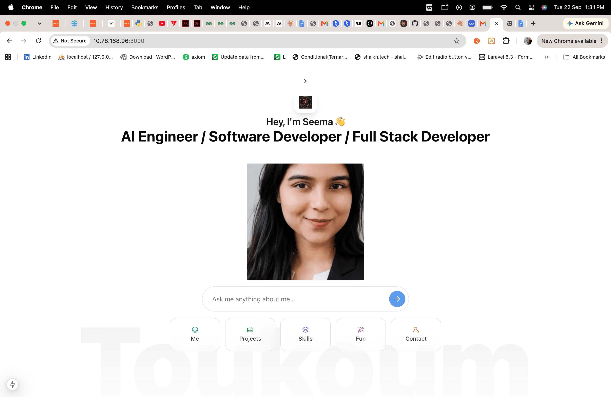

# World's first AI portfolio 🤖✨

**Static portfolios are dead.**  
So I built Seema AI portfolio.

Instead of making you scroll endlessly, my portfolio adapts to _you_.  
Ask a question — my AI avatar replies instantly.

## 👇 What can you ask?

- 🧠 **Tech recruiter?** Ask about my stack & results
- 💻 **Dev?** Dive into my code & mindset
- 🧑‍🤝‍🧑 **Friend or family?** See what I’ve been working on

---

This is not a portfolio.  
It’s a **conversation tailored to your curiosity**.

➡️ **Try it now:**  
_What will you ask?_

## 🚀 How to run

Want to run this project locally? Here's what you need:

### Prerequisites

- **Node.js** (v18 or higher)
- **pnpm** package manager
- **OpenAI API token** (for AI chat functionality)
- **GitHub token** (for GitHub integration features)

### Setup

1. **Clone the repository**

   ```bash
   git clone <your-repo-url>
   cd portfolio
   ```

2. **Install dependencies**

   ```bash
   pnpm install
   ```

3. **Environment variables**
   Create a `.env` file in the root directory:

   ```env
   OPENAI_API_KEY=your_openai_api_key_here
   GITHUB_TOKEN=your_github_token_here
   ```

4. **Run the development server**

   ```bash
   pnpm dev
   ```

5. **Open your browser**
   Navigate to `http://localhost:3000`

### Getting your **tokens**

- **OpenAI API Key**: Get it from [platform.openai.com](https://platform.openai.com/api-keys)
- **GitHub Token**: Generate one at [github.com/settings/tokens](https://github.com/settings/personal-access-tokens) with repo access

#### 🔖 Tags

`#AIPortfolio` `#InnovationInTech` `#DigitalResume` `#JobSearch` `#TechInnovation` `#WebDevelopment` `#FutureTech`
